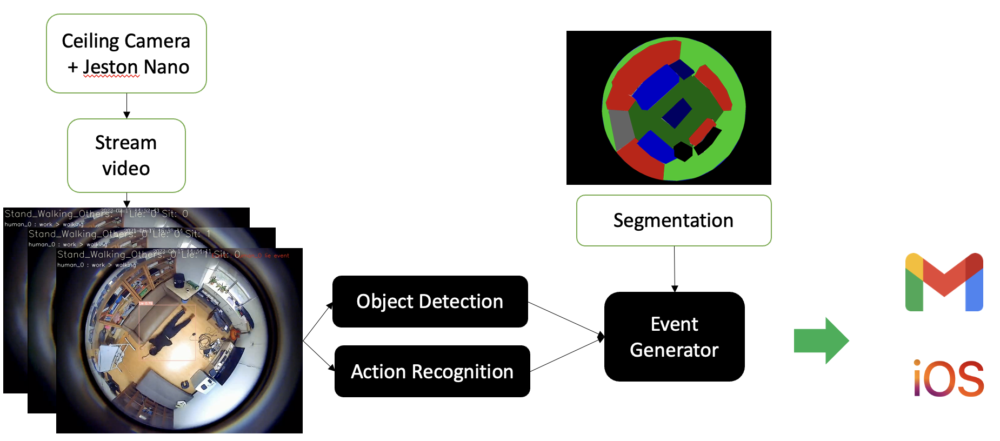
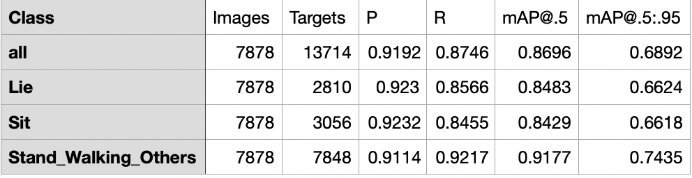
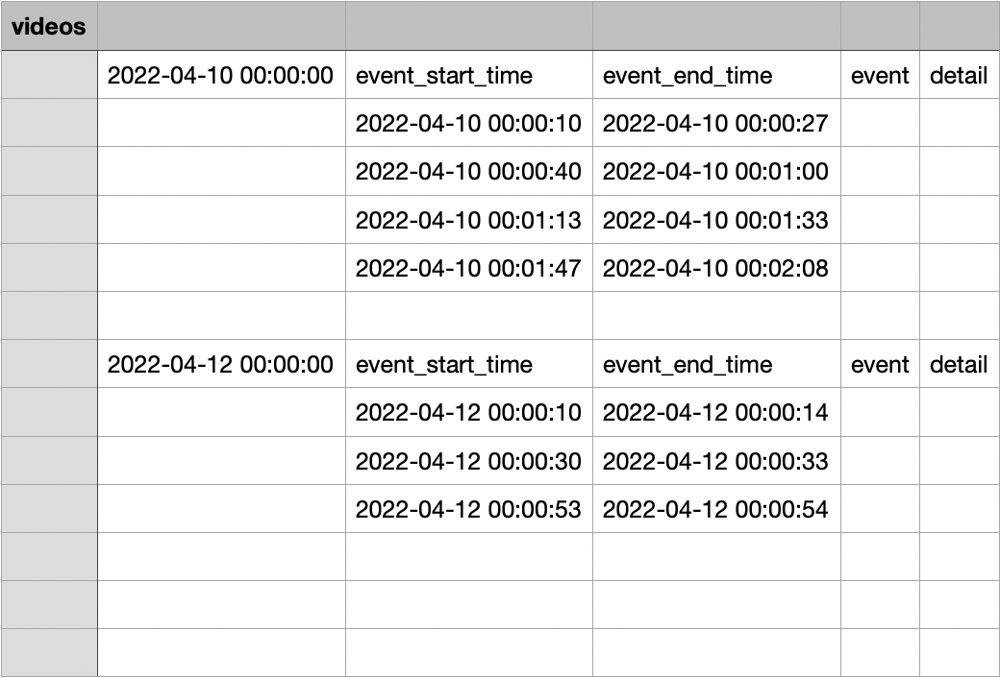
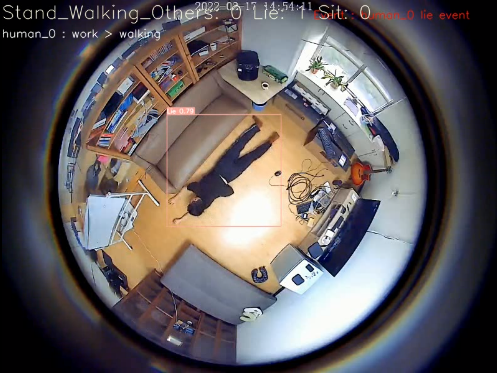
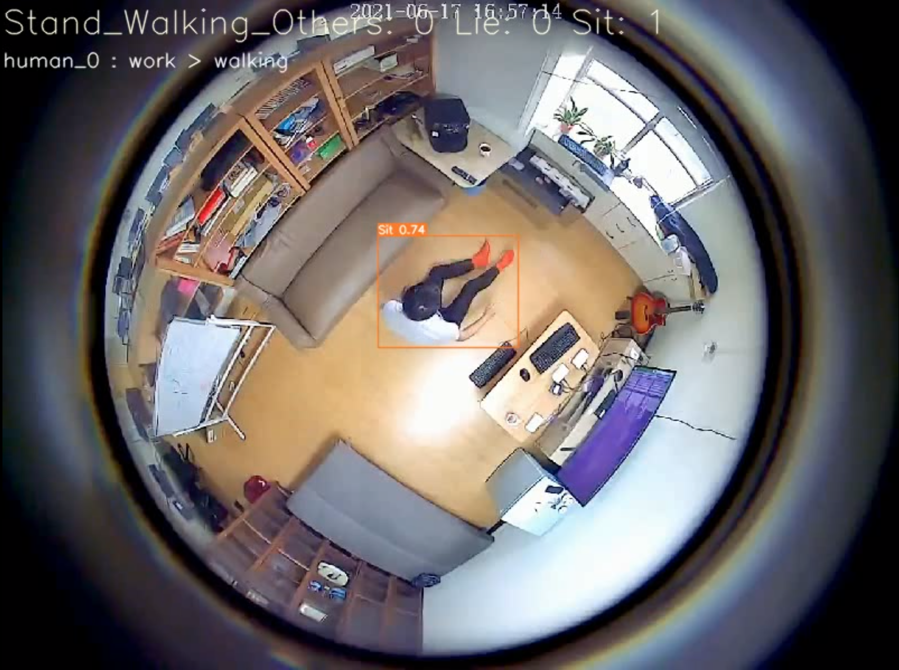
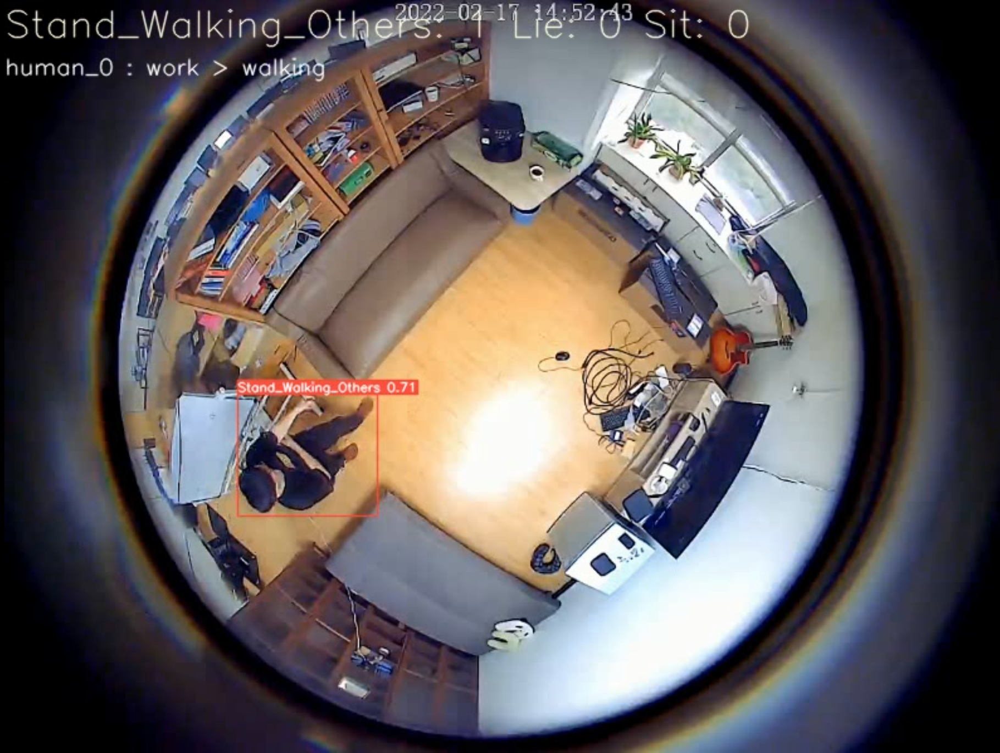

# Home Health Care System

## Overview
In this project, I used Yolov5 to build a system to help middle-aged people who don't have enough time to take care of their aging parents.

* System Flow

<p align="center">

</p>
* Testing Result

<p align="center">

</p>

## How to run
### Prerequisites
* Create virtual env and install library
    ```
    $ cd /{your_path}/home-health-care-system

    $ pip install -r requirements.txt

    $ cd /{your_path}/home-health-care-system/Server/models/object_detection/yolov5

    $ pip install -r requirements.txt
    ```
### Execute example
* Run system
    * Edit Pipeline/configs/configs.py
    * Put your videos in Server/data/videos or {video_path} which you set in the configs.py.
    * Activate your virtual enveriment.
    * in terminal (use command): 
    ```
    $ cd /{your_path}/home-health-care-system/Pipeline
    $ python run.py
    ```
    
## Results
The final result will save in Report/Events folder or {report_save_path} which you set in the configs.py

* Report/Events/{seen_name}/
    * Report.csv

    <p align="center">
    
    </p>
* Report/Events/{seen_name}/videos
    * {date_time}.mp4
    * {date_time}.json
    * {date_time}_{start-time to end-time}.mp4, ...
    
    <p align="center">
    
     
    
    </p>

## Reference
* [Yolov5](<"https://github.com/ultralytics/yolov5">)

